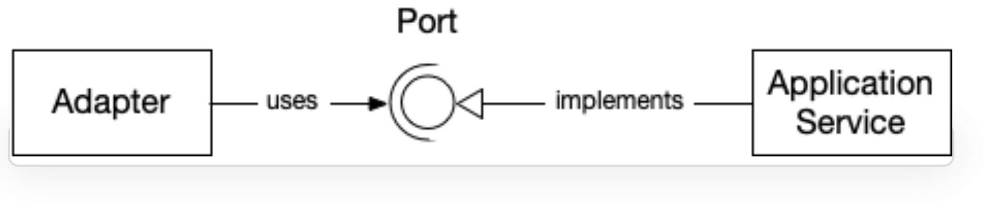
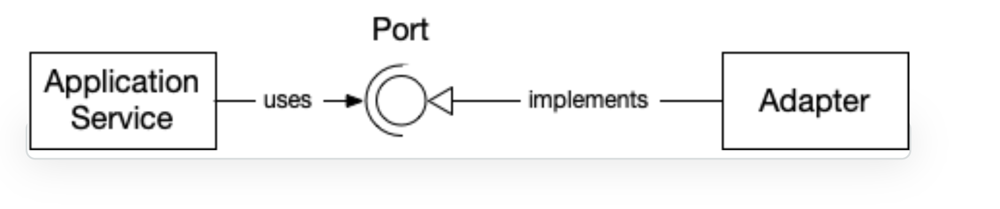
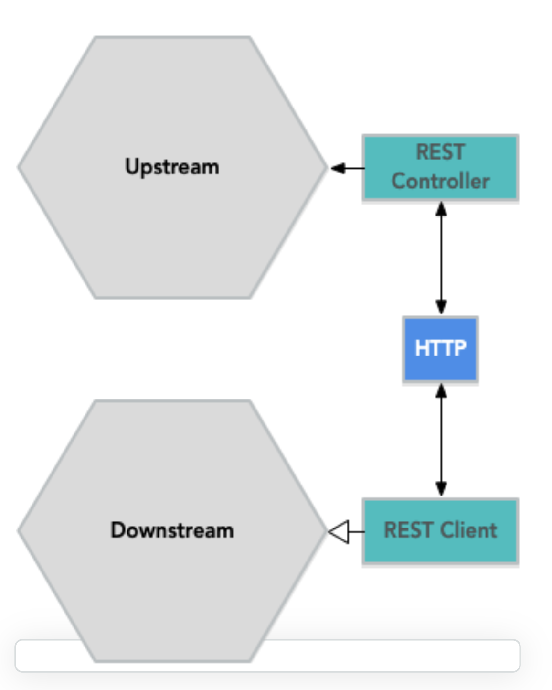
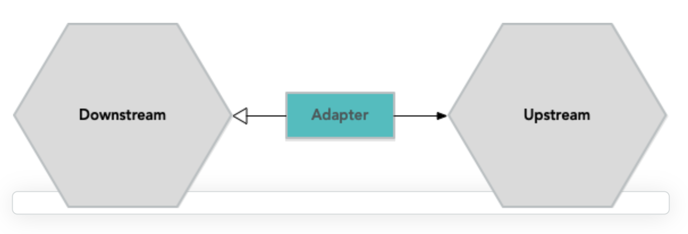

# hexagonal-architecture

- layered architecture 
    - 
    - 상위 레이어는 하위 레이어와 상호 작용할 수 있지만 반대 방향으로는 상호 작용할 수 없음
    - application layer와 domain layer 는 hexagonal architecture 와 동일한 역할을 함
    - UI layer와 database layer 는 hexagonal architecture 의 동작 방식과 다르다
        - UI layer : input adapter
        - database layer : output adapter
    
- hexagonal architecture
    -     
    - domain model
        - 모든 비즈니스 결정이 이루어지는 비즈니스 로직이있는 곳
        - 비즈니스 자체가 변경되지 않는 한, 가장 적게 변경 될 수 있는 소프트웨어의 가장 안정적인 부분
        
    - application service : 클라이언트가 도메인 모델과 상호 작용하는 창구(facade) 역할을 한다
        - stateless
            - 클라이언트와 상호작용하면서 변경될 수 있는 상태를 유지하지 않는다
            - operation 을 실행하기 위한 정보는 application service 메소드의 인풋 파라미터로 들어가야 한다 
            
        - 시스템 보안을 강화한다
            - 인가된 요청인지를 확인하는 작업을 application service 에서 담당한다
        
        - DB 트랜잭션 제어
            - application service method 가 하나의 트랜잭션을 형성해야 한다(성공시 commit, 실패시 rollback)
            - 같은 트랜잭션이 여러개의 application service에 걸쳐 있다면 domain service로의 분리나 domain event의 사용을 고려해 본다
          
        - orchestration
            - business logic을 포함하지 않는다. 단지 business operation 을 조정할 뿐이다
                - ID로 aggregate를 찾고 aggregate의 메소드 호출, aggregate 저장 및 리턴
            - orchestration 이란 적절한 순서로 적절한 domain object를 찾아서 호출하는 것이다
                - domain object에 input parameter를 넣어서 적절한 output이 나와야 한다
            - application service에서 많은 일을 하고 있다면 아래와 같은 사항을 검토해봐야 한다
                - application service에서 비즈니스 결정을 하고 있는가 아니면 도메인 모델에서 비즈니스 결정을 하고 있는가
                - 코드의 일부가 domain event listener로 옮겨질 수 있는가
    
    - Domain Event Listeners
        - domain event listener는 처음에 이벤트를 발행한 메소드의 결과에 영향을 줄 수 없어야 한다 (*1)
            - 즉 자신만의 별도의 트랜잭션을 가져야 한다
        - domain listener는 도메인 모델 내부가 아니라 application service 계층에 속한다
            - domain event에 의해 호출되는 특별한 application service
            - 어떠한 business logic도 포함하지 않는다
        - 동일한 트랜잭션 내에서 여러 aggregate가 변경될 경우, 도메인 이벤트를 통해 이루어지는것이 좋다
            - (*1) 의 원칙에 위배되지만 꼭 필요한 경우는 원칙에 위배되는 설계도 필요하다
    
    - Input and Output
        - application service 를 설계할 때, input data(메소드의 매개변수) 와 return data 를 
          결정하는 것이 중요하다. 아래와 같은 세가지 대안이 있다
            - Entities and Aggregates (domain model)
                - aggregate 사이즈가 작고 비즈니스 로직이 없을때 사용하기 좋다
                - client 가 REST로 접근하며 aggregate가 JSON, XML로 serialize 될수 있을때 사용하기 좋다
                - aggregate를 별도의 DTO로 변환할 필요가 없다는 장점이 있다
                - client와 도메인 모델의 결합도가 높아지는 단점이 있다.
                - client가 aggregate를 비일관된 상태로 만들거나 허용되지 않는 작업을 수행할 수 없도록 해야 한다
            - Data Transfer Objects
                - application service가 DTO 와 domain model 간의 변환을 담당한다
                - domain model에 business logic이 많을때, aggregate가 복잡할 때, domain model에 많은 변경이 일어날 때 사용하면 좋다
                - client와 도메인 모델이 decoupling 되는 장점이 있다
                - 실제로 필요한 데이터만 client와 application service간에 전달되어 성능이 향상된다
                - DTO와 aggregate를 변환하는 작업이 번거로운 점이 단점이다  
            - Domain Payload Objects
                - aggregate와 DTO의 조합(DPO 내에 여러개의 domain object 가 있는 형태)              
                - aggregate의 크기가 작고 여러개의 aggregate를 다뤄야 할때 유리하다
            
    - Input Validation
        - aggregate 를 일관된 상태로 유지하기 위해서는 aggregate를 변경시키는 입력에 대한 검증이 필요하다 
        - hexagonal architecture 에서는 user interface 에서 validation 을 수행하는것이 적합하지 않다
            - user interface 는 system 에 대한 많은 entry point중 하나이기 때문이다
        - format validation 과 content validation 의 2가지 종류가 있다
            - format validation : 값이 특정 패턴을 만족시키는지를 검사
                - value object 를 검증할 때 보통 생성자에서 값을 검증한다 
                - entity 를 검증할때
                    - 생성자나 팩토리, 세터(setter)에서 값을 검증하거나(domain model이 복잡할때)
                    - Java Bean Validation 을 사용한다(domain model이 단순할때)
                        
            - content validation : 특정 패턴을 만족시키는 값이 유효한지를 검사(ex. 인증)
                - 간단한 경우에는 format validation 처럼 생성자 내에서 validate를 할 수 있다
                - 조회 목록에 특정한 값이 존재하는지를 체크해야 하는 경우, application service 에서 체크를 수행해야 한다
                - aggregate 전체를 검증해야 할 경우, domain service에서 검증을 수행하고
                  application service는 domain service를 호출하는 식으로 검증한다 
                  
    - application service 의 크기가 중요한가?
        - application service 의 크기를 작게 유지하는 것이 좋다
        - 큰 application service를 작게 분할할 때는 각각이 응집도가 높아지도록 분할해야 한다
            - 비즈니스 로직 1개당 application service 1개
        - application service 의 네이밍을 할때, 수행하는 일에 따라 구체적으로 정하는 것이 좋다
            - EmployeeService (x), EmployeeCrudService (o), EmploymentContractTerminationUsecase (o)                  
            - 꼭 Service 라는 접미사를 붙일 필요가 없다 (ex. Usecase, Orchestrator)
        - command based application service 는 application service 를 하나의 command로 본다
            - 모든 application service는 한개의 command를 수행하는, 단 한개의 메소드를 갖는다(다형성 이용)
            - application service가 자연스럽게 분할되는 효과를 갖는다(사이즈를 작게 유지)           
            - 코드 예시 
              ```
                public interface Command<R> {}
              
                public interface CommandHandler<C extends Command<R>, R> { 
                     R handleCommand(C command);
                }
              
                public class CommandGateway { 
                     public <C extends Command<R>, R> R handleCommand(C command) {
                         var handler = commandHandlers.findHandlerFor(command)
                         .orElseThrow(() -> new IllegalStateException("No command handler found"));
                         return handler.handleCommand(command);
                     }
                }
                  
                public class CreateCustomerCommand implements Command<Customer> {
                     private final String name;
                     private final PostalAddress address;
                     private final PhoneNumber phone;
                     private final EmailAddress email;
                }
                 
                public class CreateCustomerCommandHandler implements CommandHandler<CreateCustomerCommand, Customer> { 

                    @Override
                    @Transactional
                    public Customer handleCommand(CreateCustomerCommand command) {
                        var customer = new Customer();
                        customer.setName(command.getName());
                        customer.setAddress(command.getAddress());
                        customer.setPhone(command.getPhone());
                        customer.setEmail(command.getEmail());
                        return customerRepository.save(customer);
                    }
                }
              
              ```

    - Ports and Adapters
        - port 란 무엇인가? 
            - 특정한 목적의 시스템과 외부 세계와의 인터페이스
            - client가 시스템에 접근하기 위한 창구(inbound port)이자 시스템이 외부 시스템으로 접근하기 위한 창구(outbound port)
            - 특정 기술에 종속되지 않는 응용 프로그래밍 인터페이스 (API) 
            - 
            - 내부 육각형의 각 측면이 포트이고 바깥쪽 육각형과의 사이 공간에 adapter 를 위치시킬수 있다     
        
        - adapter 란 무엇인가?
            - adapter 는 특정한 기술을(web browser, mobile device, hardware device 등)
              사용하여 포트를 이용해 상호작용을 가능하게 한다
            - 한개의 port 에 여러개의 adapter 가 존재할 수 있다
            - 여러개의 port에 한개의 adapter 가 존재할 수 있다  
        
        - port와 adapter 의 코드 구현
            - port 는 코드에서 주로 interface 로 표현된다
            - 외부에서 시스템으로 접근할 때, port 구현체(inbound adapter)는 application service 가 된다
                - 
                - (REST 통신 방식일 때, adapter 는 controller)
                - adapter 가 port(application service)를 사용한다
                   
            - 내부에서 외부 시스템으로 접근할 때, port 구현체는 outbound adapter가 된다
                - 
                - application service(또는 domain model)이 adapter를 사용하여 외부와 통신한다
                
            - 인터페이스 쪽으로 의존성이 생기는 구조
            - application service와 adapter 가 decoupling 된다
        
        - inbound adapter(REST) 예시
            - 
            - REST Controller = inbound adapter
            - Application Service = inbound port 
            - protocol을 준수하는 한, client가 누구인지는 상관하지 않는다
    
        - outbound adapter(REST) 예시
            - 
           
    - Multiple Bounded Contexts
        - 서로 통신해야 하는 여러개의 bounded context 가 있을 때
            - 두개의 bounded context 가 분리되어 있어 서로 REST 통신할 때
                - 
                - upstream(server) 과 downstream(client) 각각에 adapter 가 필요하다
            - 두개의 bounded context 가 하나의 monolithic system 안에 존재할 때 
                - 
                - 1개의 adapter 가 필요하다
                - adapter 는 downstream context 의 port 를 구현하고 upstream context의 port 를 호출한다
