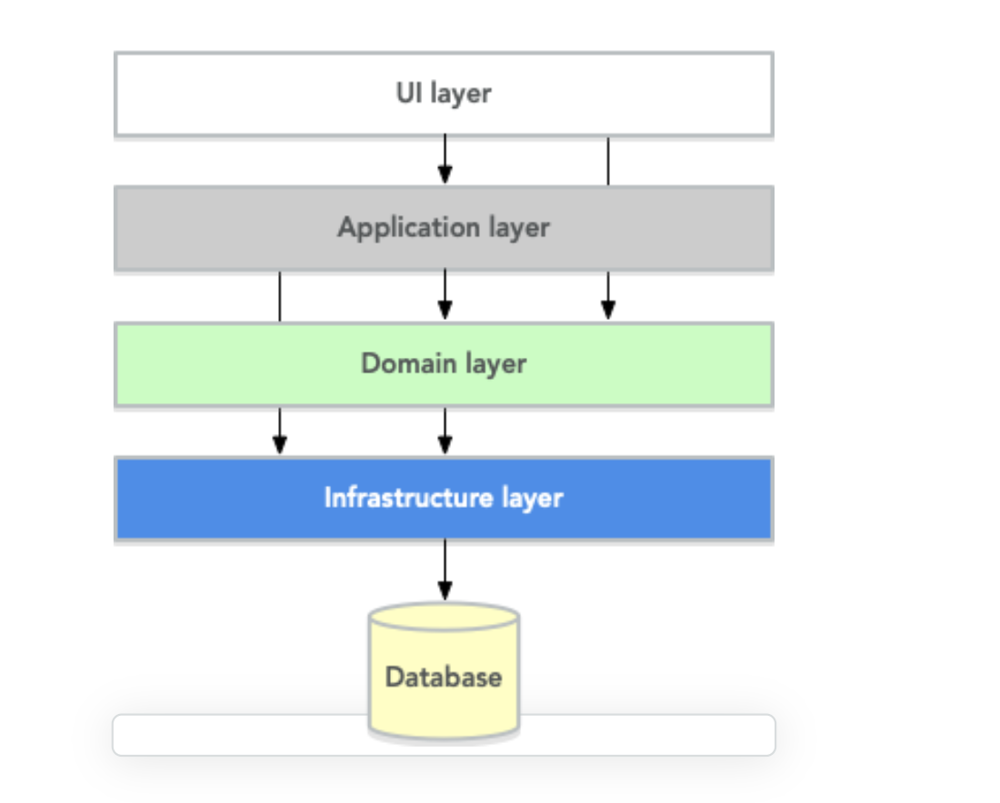
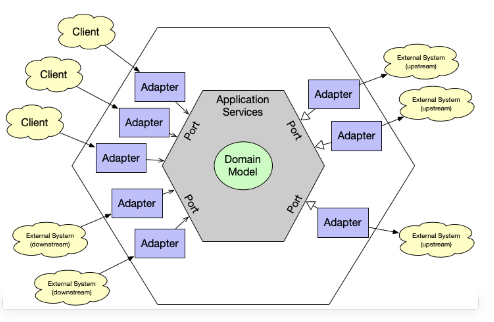

# hexagonal-architecture

- 전통적인 layered architecture 와 hexagonal architecture와의 비교
- layered architecture 
    - 
    - 상위 레이어는 하위 레이어와 상호 작용할 수 있지만 반대 방향으로는 상호 작용할 수 없음
    - application layer와 domain layer 는 hexagonal architecture 와 동일한 역할을 함
    - UI layer와 database layer 는 hexagonal architecture 의 동작 방식과 차이가 있음 

- hexagonal architecture
    -     
    - domain model
        -  모든 비즈니스 결정이 이루어지는 비즈니스 로직이있는 곳
        -  비즈니스 자체가 변경되지 않는 한, 가장 적게 변경 될 수 있는 소프트웨어의 가장 안정적인 부분
        
    - application service : 클라이언트가 도메인 모델과 상호 작용하는 파사드 역할을 한다
        - stateless
            - 클라이언트와 상호작용하면서 변경될 수 있는 상태를 유지하지 않는다
            - operation 을 실행하기 위한 정보는 application service 메소드의 인풋 파라미터로 들어가야 한다 
        - 시스템 보안을 강화한다
            - 인가된 요청인지를 확인하는 작업을 application service 에서 하는게 좋다
        - DB 트랜잭션 제어
            - application service method 가 하나의 트랜잭션을 형성해야 한다(성공시 commit, 실패시 rollback)
            - 같은 트랜잭션이 여러개의 application service에 걸쳐 있다면, domain service로의 분리도 생각해볼 필요가 있다
        - orchestration
            - business logic을 포함하지 않는다. 단지 business operation 을 조정할 뿐이다
                - ID로 aggregate를 찾고 aggregate의 메소드 호출, aggregate 저장 및 리턴
            - orchestration 이란 적절한 순서로 적절한 domain object를 찾아서 호출하는 것이다
                - domain object에 input parameter를 넣어서 적절한 output이 나와야 한다
            - application service에서 많은 일을 하고 있다면 아래와 같은 사항을 검토해봐야 한다
                - application service에서 비즈니스 결정을 하고 있는가 아니면 도메인 모델에서 비즈니스 결정을 하고 있는가
                - 코드의 일부가 domain event listener로 옮겨질 수 있는가
    
    - Domain Event Listeners
        - domain event listener는 처음에 이벤트를 발행한 메소드의 결과에 영향을 줄 수 없어야 한다 (*1)
            - 즉 자신만의 트랜잭션을 가져야 한다
        - domain listener는 도메인 모델 내부가 아니라 application service 계층에 속한다
            - domain event에 의해 호출된다
            - 어떠한 business logic도 포함하지 않는다
        - 동일한 트랜잭션 내에서 여러 aggregate가 변경될 경우, 도메인 이벤트를 통해 이루어지는것이 좋다
            - (*1) 의 원칙에 위배되지만 꼭 필요한 경우는 원칙에 위배되는 설계도 필요하다
    
    - Input and Output
        - application service 를 설계할 때, input data(메소드의 매개변수) 와 return data 를 
          결정하는 것이 중요하다. 아래와 같은 세가지 대안이 있다
            - Entities and Aggregates (domain model)
                - aggregate 사이즈가 작고 비즈니스 로직이 없을때 사용하기 좋다
                - client 가 REST로 접근하며 aggregate가 JSON, XML로 serialize 될수 있을때 사용하기 좋다
                - aggregate를 별도의 DTO로 변환할 필요가 없다는 장점이 있다
                - client와 도메인 모델의 결합도가 높아지는 단점이 있다.
                - client가 aggregate를 비일관된 상태로 만들거나 허용되지 않는 작업을 수행할 수 없도록 해야 한다
            - Data Transfer Objects
                - application service가 DTO 와 domain model 간의 변환을 담당한다
                - domain model에 business logic이 많을때, aggregate가 복잡할 때, domain model에 많은 변경이 일어날 때 사용하면 좋다
                - client와 도메인 모델이 decoupling 되는 장점이 있다
                - 실제로 필요한 데이터만 client와 application service간에 전달되어 성능이 향상된다
                - DTO와 aggregate를 변환하는 작업이 번거로운 점이 단점이다
            - Domain Payload Objects
                - 
                - aggregate 와  DTO의 조합
        
         
    
    
    
    
